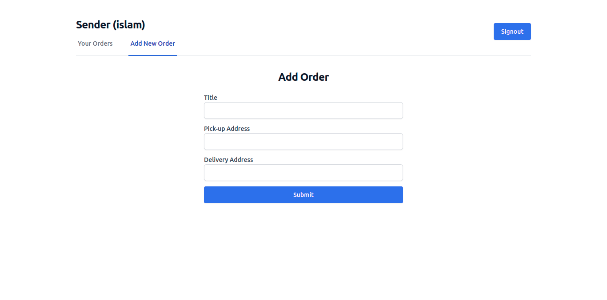
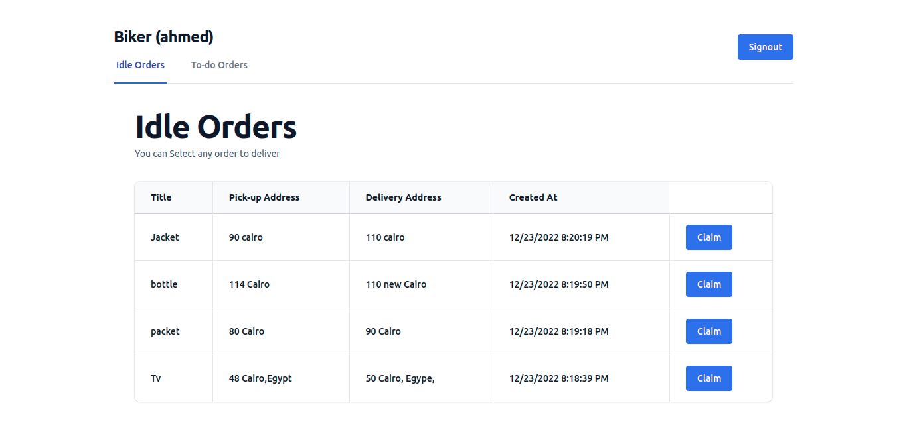
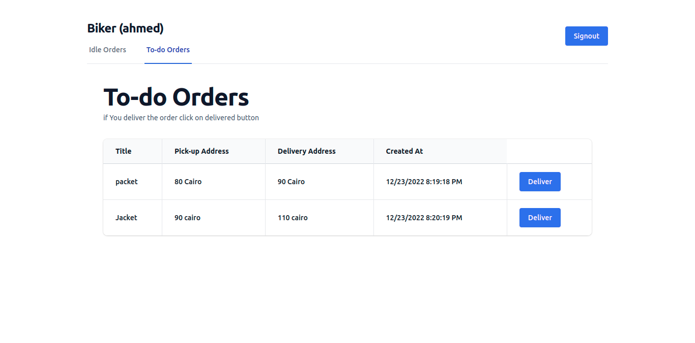

# Delivery Service

A private delivery service company in Cologne handles the collection and delivery of parcels for people.

## features.

### 1. A sender is able create a orders to be delivered by specifying pick-up and drop-off address.

### 2. A sender is able to see the status of his orders.

### 3. A bikeris able to see a list of the orders.

### 4. A biker is able to pick up a parcel.

### 5. Once a parcel is picked up by a biker, it cannot be picked up by other bikers.

### 6. A biker is able to input the timestamp of the pickup and the delivery for each order

### 7. The status of the order should be updated for the sender.

